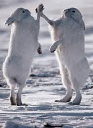

```{r setup, include=FALSE}
knitr::opts_chunk$set(echo = TRUE)
```

#**Task 1 (individual): Data wrangling & visualization (showshoe hares)**

For Task 1 you will wrangle, then create a final visualization and summary table, of physical characteristics for snowshoe hares observed in Bonanza Creek Experimental Forest. 

**Data**: download showshoe_data.csv [here](https://drive.google.com/file/d/1d4LGOzyXHuQztwVQjU8IdmVvzRACVps4/view?usp=sharing)

**Information & metadata**: click [here](https://portal.lternet.edu/nis/metadataviewer?packageid=knb-lter-bnz.55.22)

**Study citation**: [Kielland K., F. S. Chapin, R. W. Ruess. 2017. Snowshoe hare physical data in Bonanza Creek Experimental Forest: 1999-Present. Environmental Data Initiative](https://doi.org/10.6073/pasta/03dce4856d79b91557d8e6ce2cbcdc14). 


You get to decide what variables and summary statistics to visualize. 

Here’s what you should prepare: 

A single polished HTML (knitted from .Rmd), planning that this might be a post/project you’d include on your personal blogdown site, that includes at least:

1.	A useful descriptive introductory summary (3 - 4 sentences) of what’s contained in the project

Snowshoe hares, *Lepus americanus*, are a 'keystone' prey species in northern boreal forests and experience population fluctuations of 8-11-years. Despite intense responses of both vegetation and predators to changes in hare densities, landscape-scale comparisons of hare populations in Alaska have been limited to qualitative descriptions. We conducted capture-recapture studies of snowshoe hares at 5 locales in the Tanana valley, from Tok in the east to Clear in the west from 1999 to 2002. 

2.	Image(s), with captions and necessary citation(s), of showshoe hares and/or a map of the study area





3.	All of your organized and well-annotated code (with warnings/messages hidden) used to create at least:

-	One finalized graph about the Bonanza Creek snowshoe hare population (you pick which variables, how you want to wrangle it beforehand, and which type of visual to create - but make sure it is beautifully finalized)

##Load libraries
```{r}
library(here) #constructs paths to your project's files 
library(tidyverse) #data wrangling
library(kableExtra) #to make html tables
library(skimr) #for summarizing the data
library(lubridate)#change dates
```

##Loading the data
```{r}
snowshoes <- read_csv("task1/showshoe_lter.csv")
#snowshoes <- read_csv(here("task1", "showshoe_lter.csv"))
```

##Exploring the data

Summarizing
```{r}
head(snowshoes)
summary(snowshoes)
unique(snowshoes$grid)
skim(snowshoes)
```
Clean up names
```{r}
snowshoes_clean <- snowshoes %>% 
  mutate(grid = str_to_lower(grid)) 
```
Looking to changes
```{r}
summary(snowshoes_clean)
unique(snowshoes_clean$grid)
skim(snowshoes_clean)
```
Convert `date` column to date with `lubridate`
```{r}
snowshoes_clean_date <- snowshoes_clean %>% 
  mutate(yr_mo_day = lubridate::parse_date_time(date, "%m/%d/%y"))

class(snowshoes_clean_date$yr_mo_day)
```


-	One finalized HTML table (probably created using kable & kableExtra) containing summary statistics about the snowshoe hares (again, you pick which variables, and how you want to group/summarize them)

```{r}
kable(state_table) %>% 
  kable_styling(bootstrap_options = "striped", 
                full_width = FALSE) %>% 
  add_header_above(c("", "2015 US commercial fisheries - top 5 states by value" = 2))
```


4.	Make sure that both your figure and table appear in your final knitted document, each with a useful caption. Include text associated with each to help the audience understand and interpret the results. 

## Sync with GitHub remote

Stage, commit, (pull), and push your updates to GitHub for safe storage & sharing. Check to make sure that the changes have been stored. 

## End Part 1!
